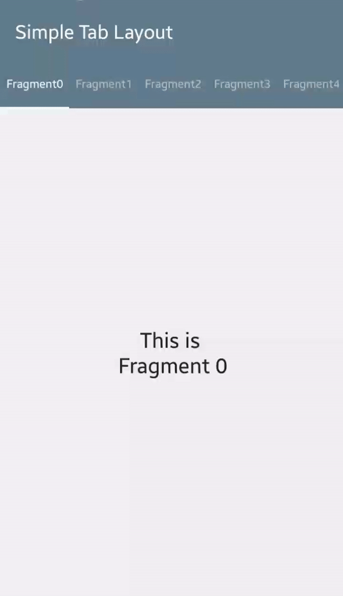
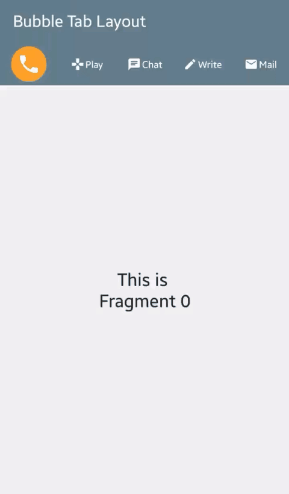
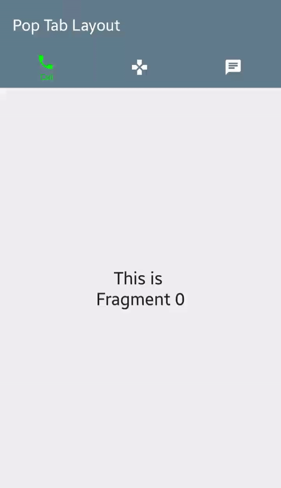
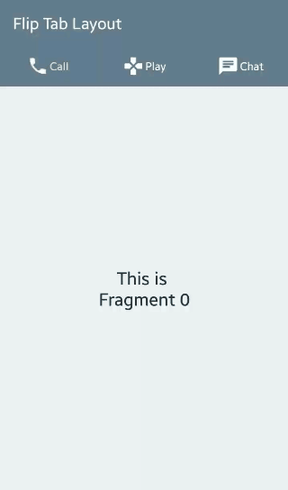

# FunTabLayout

An efficient tab layout for Android with added FUN!
<br>





## Features
- Efficient in large tab counts
- Supports multiple tab view animations

## Getting started
In your build.gradle:

```
dependencies {
   compile 'com.tompee:funtablayout:1.0.0'
}
```

Define `FunTabLayout` and ViewPager in xml layout with custom attributes.
```xml
<com.tompee.funtablayout.FunTabLayout
        android:id="@+id/tablayout"
        android:layout_width="match_parent"
        android:layout_height="52dp" />
        
<android.support.v4.view.ViewPager
        android:id="@+id/viewpager"
        android:layout_width="match_parent"
        android:layout_height="match_parent" />
```

Create a `ViewPager` instance
```java
viewPager.setAdapter(new FragmentPagerAdapter(getSupportFragmentManager()) {
    @Override
    public Fragment getItem(int position) {
        // return fragment
    }

    @Override
    public int getCount() {
        // return fragment count
    }

    @Override
    public CharSequence getPageTitle(int position) {
        // return fragment title
    }
});
```

For `SimpleTabLayout`, create a `SimpleTabLayout.Builder` and setup with ViewPager
```java
FunTabLayout tabLayout = (FunTabLayout) findViewById(R.id.tablayout);
SimpleTabAdapter.Builder builder = new SimpleTabAdapter.Builder(this).
        setViewPager(viewPager).
        setTabTextAppearance(R.style.SimpleTabText).
        setTabBackgroundResId(R.drawable.ripple).
        setTabIndicatorColor(Color.WHITE).
        setTabSelectedTextColor(Color.WHITE).
        setTabPadding(16, 16, 16, 16).
        setTabIndicatorHeight(5);
tabLayout.setUpWithAdapter(builder.build());
```

For `BubbleTabLayout`, create a `BubbleTabLayout.Builder` and setup with ViewPager
```java
FunTabLayout tabLayout = (FunTabLayout) findViewById(R.id.tablayout);
BubbleTabAdapter.Builder builder = new BubbleTabAdapter.Builder(this).
        setViewPager(viewPager).
        setTabPadding(24, 24, 24, 24).
        setTabTextAppearance(R.style.BubbleTabText).
        setTabBackgroundResId(R.drawable.ripple).
        setTabIndicatorColor(Color.parseColor("#ffa022")).
        setIconFetcher(new BubbleTabAdapter.IconFetcher() {
            @Override
            public int getIcon(int position) {
                // return default icon
            }

            @Override
            public int getSelectedIcon(int position) {
                // return selected icon
            }
        }).
        setIconDimension(50);
tabLayout.setUpWithAdapter(builder.build());
```

For `PopTabLayout`, create a `PopTabLayout.Builder` and setup with ViewPager
```java
FunTabLayout tabLayout = (FunTabLayout) findViewById(R.id.tablayout);
PopTabAdapter.Builder builder = new PopTabAdapter.Builder(this).
        setViewPager(viewPager).
        setTabPadding(24, 24, 24, 24).
        setTabTextAppearance(R.style.PopTabText).
        setTabBackgroundResId(R.drawable.ripple).
        setTabIndicatorColor(Color.GREEN).
        setIconFetcher(new PopTabAdapter.IconFetcher() {
            @Override
            public int getIcon(int position) {
                // return icon
            }
        }).
        setIconDimension(70).
        setDefaultIconColor(Color.WHITE).
        setPopDuration(2000);
tabLayout.setUpWithAdapter(builder.build());
```

For `FlipTabLayout`, create a `FlipTabLayout.Builder` and setup with ViewPager
```java
FunTabLayout tabLayout = (FunTabLayout) findViewById(R.id.tablayout);
FlipTabLayout.Builder builder = new FlipTabLayout.Builder(this).
        setViewPager(viewPager).
        setTabPadding(24, 24, 24, 24).
        setTabTextAppearance(R.style.FlipTabText).
        setTabBackgroundResId(R.drawable.ripple).
        setTabIndicatorColor(Color.YELLOW).
        setIconFetcher(new PopTabAdapter.IconFetcher() {
            @Override
            public int getIcon(int position) {
                // return icon
            }
        }).
        setIconDimension(80).
        setDefaultIconColor(Color.WHITE).
        setPopDuration(2000);
tabLayout.setUpWithAdapter(builder.build());
```

## Attributes
### FunTabLayout
| method  | description |
| ------------- | ------------- |
| setTabVisibleCount | Visible tab count. If greater than actual tab count, will use tab count instead |
| setPositionThreshold | Threshold on when to change tabs. Default value is 0.6 |

### SimpleTabAdapter
| method  | description |
| ------------- | ------------- |
| setTabPadding           | Padding of each tab view in pixels |
| setTabTextAppearance    | Text appearance of tab view |
| setTabBackgroundResId   | Background resource of tab view |
| setTabIndicatorColor    | Tab indicator bar color |
| setTabSelectedTextColor | Text color of tab when selected |
| setTabIndicatorHeight   | Tab indicator bar height |

### BubbleTabAdapter
| method  | description |
| ------------- | ------------- |
| setTabPadding           | Padding of each tab view in pixels |
| setTabTextAppearance    | Text appearance of tab view |
| setTabBackgroundResId   | Background resource of tab view |
| setTabIndicatorColor    | Tab indicator color |
| setIconFetcher          | Method for providing icons |
| setIconDimension        | Default icon dimension in pixels |

### PopTabAdapter
| method  | description |
| ------------- | ------------- |
| setTabPadding           | Padding of each tab view in pixels |
| setTabTextAppearance    | Text appearance of tab view |
| setTabBackgroundResId   | Background resource of tab view |
| setTabIndicatorColor    | Icon and text indicator bar color |
| setIconFetcher          | Method for providing icons |
| setIconDimension        | Default icon dimension in pixels |
| setDefaultIconColor     | Default icon color |
| setPopDuration          | Duration of text pop animation |

### FlipTabAdapter
| method  | description |
| ------------- | ------------- |
| setTabPadding           | Padding of each tab view in pixels |
| setTabTextAppearance    | Text appearance of tab view |
| setTabBackgroundResId   | Background resource of tab view |
| setTabIndicatorColor    | Icon and text indicator bar color |
| setIconFetcher          | Method for providing icons |
| setIconDimension        | Default icon dimension in pixels |
| setDefaultIconColor     | Default icon color |

## Thanks
The RecyclerView approach in FunTabLayout is an extension of nshmura's RecyclerTabLayout
https://github.com/nshmura/RecyclerTabLayout

## Coming soon!
More tablayout adapters. Watch out!

## License
```
MIT License

Copyright (c) 2017 tompee

Permission is hereby granted, free of charge, to any person obtaining a copy
of this software and associated documentation files (the "Software"), to deal
in the Software without restriction, including without limitation the rights
to use, copy, modify, merge, publish, distribute, sublicense, and/or sell
copies of the Software, and to permit persons to whom the Software is
furnished to do so, subject to the following conditions:

The above copyright notice and this permission notice shall be included in all
copies or substantial portions of the Software.

THE SOFTWARE IS PROVIDED "AS IS", WITHOUT WARRANTY OF ANY KIND, EXPRESS OR
IMPLIED, INCLUDING BUT NOT LIMITED TO THE WARRANTIES OF MERCHANTABILITY,
FITNESS FOR A PARTICULAR PURPOSE AND NONINFRINGEMENT. IN NO EVENT SHALL THE
AUTHORS OR COPYRIGHT HOLDERS BE LIABLE FOR ANY CLAIM, DAMAGES OR OTHER
LIABILITY, WHETHER IN AN ACTION OF CONTRACT, TORT OR OTHERWISE, ARISING FROM,
OUT OF OR IN CONNECTION WITH THE SOFTWARE OR THE USE OR OTHER DEALINGS IN THE
SOFTWARE.
```
